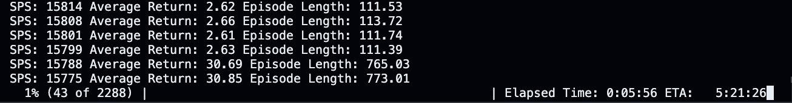

<a name="readme-top"></a>

<br />
<div align="center">
  <h2 align="center">Language Emergence in Open-Ended Environments</h2>
</div>

<br/>
This repository contains the code and data for our <a href="https://arxiv.org/pdf/2408.14649" target="_blank">paper on emergent language</a> in complex, situated multi-agent systems. While traditional research on language emergence has largely relied on reference games with simple interactions, our work explores how communication develops in more sophisticated, open-ended environments where agents interact over multiple time steps.

## Table of Contents
- [Table of Contents](#table-of-contents)
- [Getting Started](#getting-started)
  - [Installation](#installation)
- [Usage](#usage)
- [Environment and Reward](#environment-and-reward)
- [Environments](#environments)

<p align="right">(<a href="#readme-top">back to top</a>)</p>


## Getting Started

To execute my experiments, the environment and my reinforcmenet learning code has to be installed as a package first. Clone this repository, navigate with your terminal into this repository and execute the following steps.

### Installation

1. Install the repository as a pip package
   ```sh
   pip install .
   ```
2. Check whether the installation was successful
   ```sh
   python -c "import OpenEndedLanguage"
   ```

<p align="right">(<a href="#readme-top">back to top</a>)</p>


## Usage

The basic multi agent pong environment can be imported and trained like this:<br/><br/>

```python
from OpenEndedLanguage.Environments.Multi_Pong.multi_pong import PongEnv
from OpenEndedLanguage.Reinforcement_Learning.Centralized_PPO.multi_ppo import PPO_Multi_Agent_Centralized

def make_env(seed, vocab_size, sequence_length, max_episode_steps):
    env = PongEnv(width=20, height=20, vocab_size=vocab_size, sequence_length=sequence_length, max_episode_steps=max_episode_steps)
    return env

if __name__ == "__main__":
    num_envs = 64
    seed = 1
    for sequence_length in [2, 3, 1, 0]:
        vocab_size = 3
        max_episode_steps = 2048
        total_timesteps = 1000000000
        envs = [make_env(seed, vocab_size, sequence_length, max_episode_steps) for i in range(num_envs)]
        agent = PPO_Multi_Agent_Centralized(envs, device="cpu")
        agent.train(total_timesteps, exp_name=f"multi_pong_{sequence_length}", tensorboard_folder="Final_OneHot", checkpoint_path="models/checkpoints", num_checkpoints=40, learning_rate=0.001) 
        agent.save(f"models/final_model_multi_pong_{sequence_length}.pt")
```

The output of this code will look like this:
<div align="center">
  
</div>

<p align="right">(<a href="#readme-top">back to top</a>)</p>

## Environment and Reward

## Environments

In our experiments, agents are challenged to solve environments where optimal performance requires language-based communication. We have developed two such environments:

1. **Multi-Agent Pong**: In this environment, two agents must coordinate to catch two simultaneously moving balls. Each agent’s observation does not include the position of the other agent, making coordination essential. The agents receive a reward of +1 for successfully catching a ball. However, if they miss a ball, both agents receive a penalty of -1, and the episode terminates.

2. **Collectors**: Here, two agents must collect targets by colliding with them, without being able to see each other. Unlike in Pong, agents can move both vertically and horizontally. Each target has a visible countdown, within which it must be collected. Agents receive a reward of +1 for each successfully collected target, but if they fail to collect a target before the countdown expires, both agents receive a penalty of -1, and the episode ends. Due to the distance and spawn frequency of the targets, agents must use the language channel to consistently coordinate and succeed in this task.

<p align="right">(<a href="#readme-top">back to top</a>)</p>
